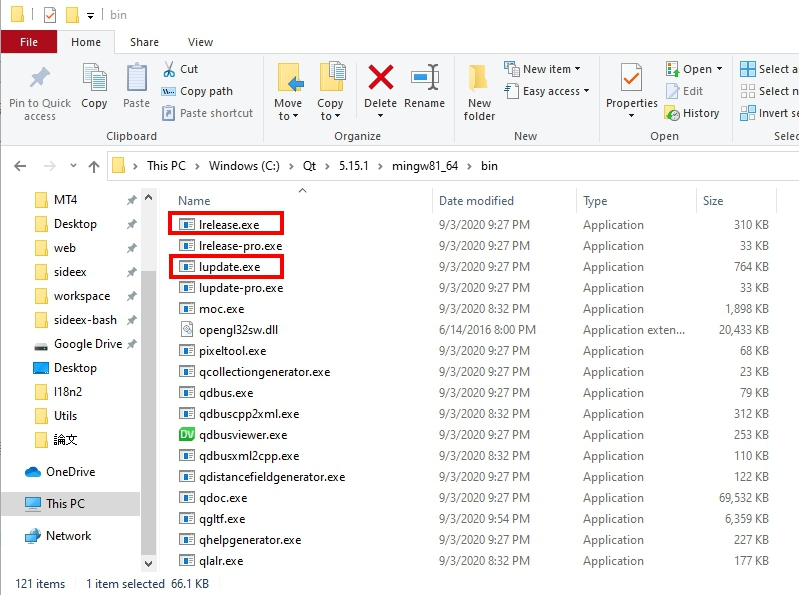
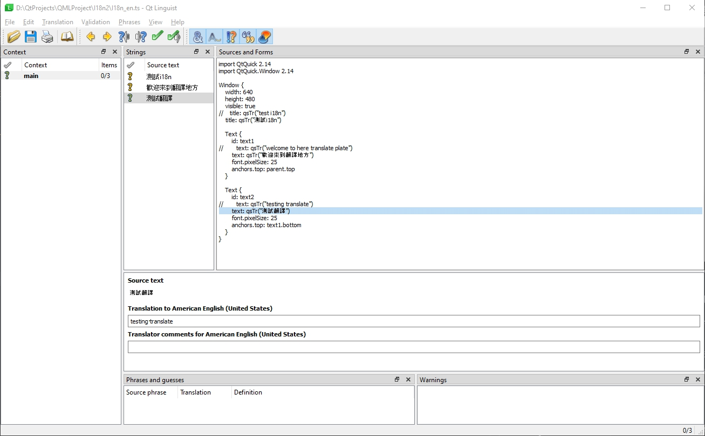

# QT i18n

## 實作
1. 需要去到QT裡面的bin資料夾內使用裡面的`lupdate`和`lrealease`，並且可以使用QT工具來翻譯

    

    * lupdate
        1. 將pro裡面的需要翻譯的導出成.ts檔，用作翻譯使用
            ```
            $ lupdate.exe -verbose -pro xx.pro -ts xx.ts
            ```
            備註：若需要翻譯程式裡面的文字`.cpp`檔內需要用tr("text")函數，這樣lupdate才會將他導出，而`.qml`檔內需要使用qsTr。
    * 使用linguits工具翻译
        1. 可以使用QT提供的工具來翻譯`.ts`檔

        

        備註：每個翻譯都需要儲存
    * lrealease
        1. 將.ts檔轉成QT使用的bin檔
            ```
            $ lrelease.exe xx.ts -qm xx.qm
            ```

2. 將`.qm`檔導入到`.qrc`裡面